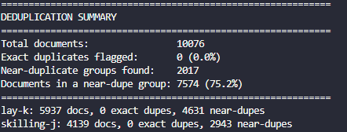

# Forensic E-Discovery Simulation Pipeline

This is a simulation of a full e-discovery and digital forensics investigation pipeline, covering the same stages a Forensic Technology analyst works through once a client receives a litigation hold or regulatory investigation. I built it to actually learn the discipline properly rather than just read about it. Every module maps to a real stage of the EDRM (Electronic Discovery Reference Model), and to functionality you'd find in commercial platforms like Relativity and Nuix.

This is a personal learning project, not commercial software. The dataset, tooling choices, and write ups below are meant to show hands on understanding of forensic methodology, not to replace a real review platform.

---

## Dataset

This project uses the Enron Email Corpus, around 600,000 real emails seized from Enron Corporation's mail servers during the FERC investigation into the company's 2001 collapse, later released publicly and now a standard reference dataset for e-discovery and forensic tooling research. Source: [Carnegie Mellon University](https://www.cs.cmu.edu/~enron/).

For this build I extracted two custodians from the full corpus:

| Custodian | Role | Emails |
|---|---|---|
| `lay-k` | Kenneth Lay, Chairman and CEO | 5,937 |
| `skilling-j` | Jeffrey Skilling, CEO | 4,139 |

10,076 emails in total. Raw data is not committed to this repository (see `.gitignore`). It gets regenerated locally by following the steps below.

---

## Build Status

| Module | Description | Status |
|---|---|---|
| 0 | Concepts and glossary | Complete |
| 1 | Ingestion and metadata extraction | Complete |
| 2 | Deduplication | Complete |
| 3 | Email threading | Complete |
| 4 | Keyword search | Planned |
| 5 | Privilege detection | Planned |
| 6 | Production export | Planned |
| 6B | DSAR response generator | Planned |
| 6C | AI assisted review summary | Planned |
| 7 | Windows artefact / DFIR parser | Planned |
| 8 | Streamlit review dashboard | Planned |

---

## How to Run

```powershell
# 1. Install dependencies
pip install rapidfuzz python-evtx streamlit pandas jinja2 reportlab

# 2. Download the Enron corpus and extract one or more custodian
#    folders into data/raw/<custodian>/..., renaming each file to end in .eml
#    (the original archive ships files with no extension, e.g. "5.")

# 3. Run ingestion
python -m ingestion.email_parser
```

This creates `forensic.db` (SQLite) and appends to `CHAIN_OF_CUSTODY.md`.

---

## Module 1: Ingestion and Metadata Extraction

### What it does

Module 1 is the foundation of the whole pipeline. It takes a folder of raw `.eml` files, exactly as they would arrive after a forensic collection, and turns them into a structured, searchable, integrity checked database. For every file under `data/raw/`, it:

1. Hashes the raw file with MD5 before any parsing touches it, so the hash represents the file exactly as collected.
2. Parses the RFC 822 / MIME structure to pull out sender, recipients (To, Cc, Bcc), subject, date, body text, attachments, the `Message-ID` header, and the `In-Reply-To` header.
3. Works out the custodian from the collection folder structure (`data/raw/<custodian>/...`).
4. Writes one row per email into a `documents` table in `forensic.db` (SQLite).
5. Appends an entry to `CHAIN_OF_CUSTODY.md` for every newly ingested file: item ID, custodian, file path, MD5 hash, ingestion timestamp.

Code lives in [`ingestion/email_parser.py`](ingestion/email_parser.py) for the parsing logic and [`ingestion/metadata_store.py`](ingestion/metadata_store.py) for the database schema and writes. I kept these separate on purpose, so the code that understands email formatting never has to know anything about SQL, and vice versa.

### Why it matters

This is basically the Processing stage of the EDRM model, just at a small scale. It's the same first step any commercial e-discovery platform runs on collected data. Two things mattered most while building it, and both are genuinely load bearing in real forensic work.

Hash the file before you touch it. If you parse first and hash second, the hash only proves your own derived copy hasn't changed, not the original evidence. Get this order wrong and the hash stops being useful as proof of anything.

Keep the custody log append only. Every ingested file gets a permanent line in `CHAIN_OF_CUSTODY.md`, and nothing ever gets rewritten. If you could edit the log after the fact, it would stop being evidence of anything.

### Result

```
============================================================
INGESTION SUMMARY
============================================================
Total .eml files found:        10076
Newly processed:                10076
Already ingested (skipped):     0
Unique custodians:              2
  -> lay-k, skilling-j
Date range:                      1980-01-01T00:00:00+00:00  to  2002-01-30T19:48:06+00:00
============================================================
```

`forensic.db`, 10,076 rows, about 26.4 MB:


A single parsed record, queried directly from the database:


### Real data quality findings

Checking the pipeline against real data, instead of just trusting the parsed output, turned up two genuine forensic findings.

**A broken date header.** One email's raw `Date` header reads "Mon, 31 Dec 1979 16:00:00 -0800", which is almost certainly a typo for 1999. It's a real example of why date range filtering in e-discovery can never be applied blindly. A single bad timestamp could pull a document outside an agreed relevance window, or wrongly exclude one that belongs inside it.

**A Bcc/Cc duplication artefact.** 2,533 of the 10,076 emails have something in the `Bcc` field, which is unusually high since blind copies are meant to be hidden. Checking the raw header (visible in the screenshot above, document ID 5) showed the `Bcc` value is identical to the `Cc` value on these records. It's not a real blind copy. It's an artefact of how this corpus was originally exported from the custodians' Lotus Notes mailboxes. That's exactly the sort of thing you have to catch before trusting a field for a privilege or relevance decision.

---

## Module 2: Deduplication

### What it does

Module 2 reads `forensic.db` and flags duplicates two different ways, in [`analysis/deduplication.py`](analysis/deduplication.py):

1. Exact duplicates. Documents are grouped by `(custodian, file_hash_md5)`. Within each group the first ingested copy is kept, every other copy in that group is flagged `is_duplicate = 1`.
2. Near duplicates. For the documents that survive step one, body text is compared within each custodian using `rapidfuzz`. Anything scoring 85 or above on similarity gets grouped under a shared `near_dupe_group_id`, using a union find structure so that if A is similar to B and B is similar to C, all three land in one group even though A and C were never directly compared.

Both steps work at the custodian level on purpose. If two different custodians each happen to hold a copy of the same email, both copies survive, because who had a document is itself relevant in a real case. Only duplicates inside the same custodian's own collection get suppressed.

### Why it matters

Document review is usually billed per document, so cutting duplicates before a human ever opens a file is a direct cost saving, not just tidiness. The real lesson from building this module is that exact and near duplicate detection solve two genuinely different problems, and you need both, never just one.

### Result

```
============================================================
DEDUPLICATION SUMMARY
============================================================
Total documents:                10076
Exact duplicates flagged:       0 (0.0%)
Near-duplicate groups found:    2017
Documents in a near-dupe group: 7574 (75.2%)
============================================================

lay-k: 5937 docs, 0 exact dupes, 4631 near-dupes
skilling-j: 4139 docs, 0 exact dupes, 2943 near-dupes
```



### Real data quality findings

Zero exact duplicates looked wrong at first glance. The same email visibly exists in more than one folder of Kenneth Lay's mailbox (his `_sent`, `sent` and `all_documents` folders all mirror each other), so exact hash matching should have caught at least some of that.

Pulling the raw headers of two folder copies of the same email explained it. Same sender, same date, same subject, same body, but a different `Message-ID` on each copy, and a different `X-Folder` value:

```
data/raw/lay-k/_sent/1..eml          Message-ID: <18133935.1075840283210...>  X-Folder: ...'sent
data/raw/lay-k/all_documents/46..eml Message-ID: <29550756.1075840201886...> X-Folder: ...All documents
```

Whatever tool originally exported this corpus from the custodians' Lotus Notes mailboxes assigned a fresh, unique Message-ID to every folder copy of the same email. That means the raw bytes never match between copies, so MD5 based exact dedup is structurally blind to this kind of duplication here, even though a human reviewer would call these the same document on sight. That is exactly the gap near duplicate detection exists to close, and it is why the near-dupe pass caught 75 percent of the corpus, well above what you would expect from genuine forwards and replies alone.

---

## Module 3: Email Threading

### What it does

Module 3 reads `forensic.db` and reconstructs conversation threads, writing a `thread_id` to every document. The code is in [`analysis/email_threading.py`](analysis/email_threading.py). Two passes run in sequence.

**Pass 1 — In-Reply-To.** Every email carries a `Message-ID` header: a unique identifier stamped by the sending mail server. When a recipient hits Reply, their client writes an `In-Reply-To` header containing the `Message-ID` of the email they are replying to. Pass 1 builds a lookup table of all `Message-ID` values in the corpus, then for each document walks its `In-Reply-To` chain upward until reaching a document with no parent. That ancestor is the thread root. Every document in the chain gets the same `thread_id` (`TH-{root_doc_id}`). If an `In-Reply-To` reference points to a Message-ID not in the corpus, the chain is broken (the parent was sent by someone outside the two custodians or was never collected). The current document is treated as the root for its branch rather than being discarded.

**Pass 2 — Subject-line fallback.** Any document still sitting as a solo thread after Pass 1 gets a second chance. The base subject is extracted by stripping `Re:`, `Fwd:`, and similar prefixes repeatedly until none remain, then lowercasing the result. Documents with the same base subject (minimum ten characters, to filter out generic one-word subjects) are grouped together, with the earliest document in the group as the thread root. This pass exists because the Enron corpus was exported from Lotus Notes, which does not write RFC 822 `In-Reply-To` headers on export. Pass 1 found zero matches in this corpus. All 1,664 multi-email threads in the result came from Pass 2.

Threading is cross-custodian by design. A conversation between `lay-k` and `skilling-j` belongs in one thread, not two. This is the opposite of deduplication, which runs at the custodian level because who held a document is forensically significant. Path compression is used in the root-resolution step so each document is traced at most once regardless of chain depth, the same technique used in Module 2's union find grouping.

### Why it matters

Threading is one of the highest-visibility features in a real review platform. Reviewers in Relativity and Nuix read documents in thread view by default, because a single reply makes no sense without the email it is responding to. Producing documents without threading context is a common source of dispute between parties.

Two design decisions are worth explaining.

Threading is cross-custodian. Unlike deduplication, a conversation does not fragment just because its participants live in different custodian folders. The goal of threading is to reconstruct what actually happened, and conversations happen across people.

Broken chains are treated as roots, not errors. In a two-custodian subset of a 600,000-email corpus, many replies will reference a parent that was never collected. Silently discarding those documents would misrepresent the corpus. Treating them as thread roots preserves them while accurately reflecting that their parent context is missing.

### Result

```
============================================================
THREADING SUMMARY
============================================================
Total documents:                10076
Total threads:                  4664
  Multi-email threads:          1664
    via In-Reply-To:            0
    via subject-line fallback:  1664
  Single-email threads:         3000
Cross-custodian threads:        129
Orphaned replies:               0
Largest thread:                 1124 emails
  Root subject: Demand Ken Lay Donate Proceeds from Enron Stock Sales
============================================================
lay-k: 5937 docs, 2458 threads
skilling-j: 4139 docs, 2335 threads
```

### Real data quality findings

**Zero In-Reply-To headers confirms the Lotus Notes export did not preserve the RFC 822 threading standard.** The result is not just that some chains are broken or that parents are missing from the corpus. There are no `In-Reply-To` headers in the dataset at all. The export tool never wrote them. That means the first threading pass is structurally inapplicable to this corpus, and subject-line fallback is the only method that can produce any threading output. This is a known limitation of Lotus Notes-sourced collections and is exactly the kind of platform-specific artefact a forensic technology analyst is expected to identify and document before a review begins.

**The largest thread is a 1,124-email mass campaign, not a conversation.** "Demand Ken Lay Donate Proceeds from Enron Stock Sales" is a form letter campaign: members of the public, angry about Lay's stock sales before Enron's collapse, sent near-identical inbound emails all sharing the same subject line. Subject-line threading faithfully grouped all 1,124 of them together under one `thread_id`. A reviewer who encountered this in a real matter would apply bulk review handling: open one representative document, confirm the group is non-responsive inbound mail, and tag the entire thread in a single action. If these 1,124 emails were reviewed individually, the cost would be the same as reviewing an entire custodian's collection for what is effectively one document repeated at scale. It is also a reminder that subject-line threading groups by shared subject, not by shared conversation: a high document count on a thread is a prompt to inspect the group, not an automatic sign that something significant happened there.

---

## Tech Stack

| Layer | Tool | Why |
|---|---|---|
| Language | Python 3.12 | Industry standard for forensic scripting |
| Email parsing | `email` (stdlib) | Built in RFC 822 / MIME support, nothing hidden in a third party library |
| Database | SQLite (`sqlite3`) | Lightweight, one file, no server needed |
| Fuzzy matching | `rapidfuzz` | Used for near duplicate detection in Module 2 |
| EVTX parsing | `python-evtx` | Windows Event Log parsing in Module 7 |
| Dashboard | `streamlit` | Review UI in Module 8 |
| Data handling | `pandas` | Metadata analysis and export |
