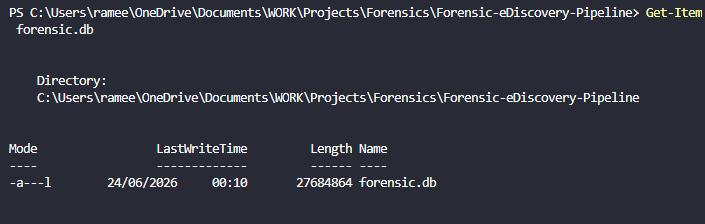
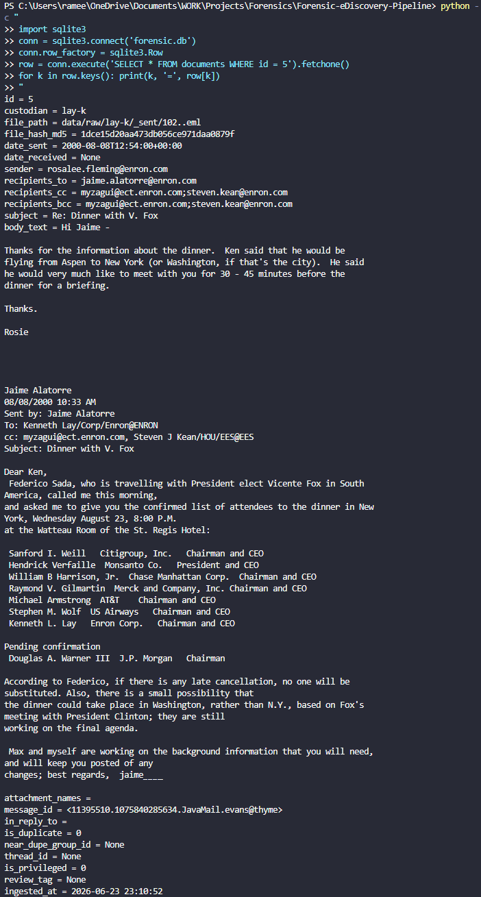

# Forensic E-Discovery Simulation Pipeline

This is a simulation of a full e-discovery and digital forensics investigation pipeline, covering the same stages a Forensic Technology analyst works through once a client receives a litigation hold or regulatory investigation. I built it to actually learn the discipline properly rather than just read about it. Every module maps to a real stage of the EDRM (Electronic Discovery Reference Model), and to functionality you'd find in commercial platforms like Relativity and Nuix.

This is a personal learning project, not commercial software. The dataset, tooling choices, and write ups below are meant to show hands on understanding of forensic methodology, not to replace a real review platform.

---

## Dataset

This project uses the Enron Email Corpus, around 600,000 real emails seized from Enron Corporation's mail servers during the FERC investigation into the company's 2001 collapse, later released publicly and now a standard reference dataset for e-discovery and forensic tooling research. Source: [Carnegie Mellon University](https://www.cs.cmu.edu/~enron/).

For this build I extracted two custodians from the full corpus:

| Custodian | Role | Emails |
|---|---|---|
| `lay-k` | Kenneth Lay, Chairman and CEO | 5,937 |
| `skilling-j` | Jeffrey Skilling, CEO | 4,139 |

10,076 emails in total. Raw data is not committed to this repository (see `.gitignore`). It gets regenerated locally by following the steps below.

---

## Build Status

| Module | Description | Status |
|---|---|---|
| 0 | Concepts and glossary | Complete |
| 1 | Ingestion and metadata extraction | Complete |
| 2 | Deduplication | Planned |
| 3 | Email threading | Planned |
| 4 | Keyword search | Planned |
| 5 | Privilege detection | Planned |
| 6 | Production export | Planned |
| 6B | DSAR response generator | Planned |
| 6C | AI assisted review summary | Planned |
| 7 | Windows artefact / DFIR parser | Planned |
| 8 | Streamlit review dashboard | Planned |

---

## How to Run

```powershell
# 1. Install dependencies
pip install rapidfuzz python-evtx streamlit pandas jinja2 reportlab

# 2. Download the Enron corpus and extract one or more custodian
#    folders into data/raw/<custodian>/..., renaming each file to end in .eml
#    (the original archive ships files with no extension, e.g. "5.")

# 3. Run ingestion
python -m ingestion.email_parser
```

This creates `forensic.db` (SQLite) and appends to `CHAIN_OF_CUSTODY.md`.

---

## Module 1: Ingestion and Metadata Extraction

### What it does

Module 1 is the foundation of the whole pipeline. It takes a folder of raw `.eml` files, exactly as they would arrive after a forensic collection, and turns them into a structured, searchable, integrity checked database. For every file under `data/raw/`, it:

1. Hashes the raw file with MD5 before any parsing touches it, so the hash represents the file exactly as collected.
2. Parses the RFC 822 / MIME structure to pull out sender, recipients (To, Cc, Bcc), subject, date, body text, attachments, the `Message-ID` header, and the `In-Reply-To` header.
3. Works out the custodian from the collection folder structure (`data/raw/<custodian>/...`).
4. Writes one row per email into a `documents` table in `forensic.db` (SQLite).
5. Appends an entry to `CHAIN_OF_CUSTODY.md` for every newly ingested file: item ID, custodian, file path, MD5 hash, ingestion timestamp.

Code lives in [`ingestion/email_parser.py`](ingestion/email_parser.py) for the parsing logic and [`ingestion/metadata_store.py`](ingestion/metadata_store.py) for the database schema and writes. I kept these separate on purpose, so the code that understands email formatting never has to know anything about SQL, and vice versa.

### Why it matters

This is basically the Processing stage of the EDRM model, just at a small scale. It's the same first step any commercial e-discovery platform runs on collected data. Two things mattered most while building it, and both are genuinely load bearing in real forensic work.

Hash the file before you touch it. If you parse first and hash second, the hash only proves your own derived copy hasn't changed, not the original evidence. Get this order wrong and the hash stops being useful as proof of anything.

Keep the custody log append only. Every ingested file gets a permanent line in `CHAIN_OF_CUSTODY.md`, and nothing ever gets rewritten. If you could edit the log after the fact, it would stop being evidence of anything.

### Result

```
============================================================
INGESTION SUMMARY
============================================================
Total .eml files found:        10076
Newly processed:                10076
Already ingested (skipped):     0
Unique custodians:              2
  -> lay-k, skilling-j
Date range:                      1980-01-01T00:00:00+00:00  to  2002-01-30T19:48:06+00:00
============================================================
```

`forensic.db`, 10,076 rows, about 26.4 MB:



A single parsed record, queried directly from the database:



### Real data quality findings

Checking the pipeline against real data, instead of just trusting the parsed output, turned up two genuine forensic findings.

**A broken date header.** One email's raw `Date` header reads "Mon, 31 Dec 1979 16:00:00 -0800", which is almost certainly a typo for 1999. It's a real example of why date range filtering in e-discovery can never be applied blindly. A single bad timestamp could pull a document outside an agreed relevance window, or wrongly exclude one that belongs inside it.

**A Bcc/Cc duplication artefact.** 2,533 of the 10,076 emails have something in the `Bcc` field, which is unusually high since blind copies are meant to be hidden. Checking the raw header (visible in the screenshot above, document ID 5) showed the `Bcc` value is identical to the `Cc` value on these records. It's not a real blind copy. It's an artefact of how this corpus was originally exported from the custodians' Lotus Notes mailboxes. That's exactly the sort of thing you have to catch before trusting a field for a privilege or relevance decision.

---

## Tech Stack

| Layer | Tool | Why |
|---|---|---|
| Language | Python 3.12 | Industry standard for forensic scripting |
| Email parsing | `email` (stdlib) | Built in RFC 822 / MIME support, nothing hidden in a third party library |
| Database | SQLite (`sqlite3`) | Lightweight, one file, no server needed |
| Fuzzy matching | `rapidfuzz` | Used for near duplicate detection in Module 2 |
| EVTX parsing | `python-evtx` | Windows Event Log parsing in Module 7 |
| Dashboard | `streamlit` | Review UI in Module 8 |
| Data handling | `pandas` | Metadata analysis and export |
